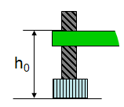

### Squadra X  / 21 marzo 2017

- ** Nome studente 1 (matr. XXX)**
- ** Nome studente 2 (matr. XXX)**
- ** Nome studente 3 (matr. XXX)**
- ** Nome studente 4 (matr. XXX)**

## Determinazione dell'accelerazione di gravità mediante misure di moto uniformemente accelerato lungo un piano inclinato

### Scopo dell'esperienza
1. Verifica della legge oraria del moto uniformemente accelerato:
    $$s(t)=s_\mathrm{in}+v_\mathrm{in} (t-t_\mathrm{in})+\frac{1}{2}a\,(t-t_\mathrm{in})^2$$

2. Verifica della dipendenza lineare tra l'accelerazione del carrello e l'inclinazione del piano.
3. Calcolo dell'accelerazione di gravità $g$ e del coefficiente di attrito $μ_k$ .

### Materiali e strumenti utilizzati
- rotaia rettilinea (piano inclinato) di lunghezza $L$;
- treppiede con asta metallica verticale da infilare nell’aggancio della rotaia per inclinarla;
- carrello (macchinina) con respingente magnetico (e propulsore a molla);
- mascherina di plexiglas trasparente con tratti scuri variamente spaziati da fissare longitudinalmente sul carrello
- metro a nastro e scala graduata lungo il piano inclinato;
- livella
- Smart Timer;
- due traguardi a fotocellula da collegare allo Smart Timer;
- questo notebook jupyter Python, dove annotare e analizzare i risultati dell'esperimento.


Il **fototraguardo** è basato su una coppia emettitore-rivelatore di raggi infrarossi a 880 nm, con un tempo caratteristico di salita di 500 ns e uno di discesa di 50 ns: un oggetto che passa attraverso il fototraguardo ostacola il fascio infrarosso provocando l'apertura del circuito. Per un oggetto che passa a 1 cm dal rivelatore infrarosso, con una velocità minore di 10 m/s, la differenza tra la lunghezza reale e quella misurata è minore di un millimetro. Documentazione [qui](https://www.sbai.uniroma1.it/labfis/strumentazione_sensori_pasco_fototraguardo.html)

### Fondamenti Teorici

Il moto senza attrito di un oggetto lungo un piano inclinato è uniformemente accelerato, secondo la legge oraria:

$$s(t)=s_\mathrm{in}+v_\mathrm{in} (t-t_\mathrm{in})+\frac{1}{2}a\,(t-t_\mathrm{in})^2$$

L’accelerazione $a$, in assenza di attrito, è legata all’accelerazione di gravità dalla semplice relazione  

$$a=g\sin\alpha$$

dove $\alpha$ è l’angolo di cui è inclinato il piano. Nel nostro caso, e in riferimento alla figura, è $H=L\sin\alpha$, da cui

$$a=g H/L$$

In presenza di una forza di attrito

$$F_k =-\mu_k m g\cos\alpha $$

avremo invece

$$ a = g(\sin\alpha - \mu_k \cos\alpha)$$

Nell'esperimento $t_0$ sarà relativo al primo sensore a fotocellula (indice 1) e t sarà relativo al secondo sensore a fotocellula (indice 2), da cui:

$$\Delta s=s_2-s_1=v_1\,\Delta t+\frac{1}{2}a\,\Delta t^2\qquad (1)$$

avendo indicato con $s_2$ e $s_1$ le distanze dei 2 sensori a fotocellula dalla sommità della rotaia ($s_0=0$).

### Descrizione dell'Esperienza

a) Determinare la posizione orizzontale della rotaia posizionando la rotaia stessa sul tavolo e posizionando il carrello al suo centro: se il carrello si muove, aggiustare la vite posta alla fine della rotaia finché il carrello non si muove più. Misurare l’altezza $h_{A0}$ tra il tavolo e il lato superiore dell'estremità della rotaia con arresto fisso con gommino, che sarà quella che successivamente sarà elevata. Misurare inoltre l'altezza $h_{B0}$ dal lato opposto.
Avvalersi della livella per controllare che la rotaia non sia inclinata sia rispetto all'asse longitudinale che a quello trasversale. Si noti che è possibilire regolare l'altezza dei supporti del treppiede mediante delle viti.
Il tavolo potrebbe essere non perfettamente orizzontale.
Misurare anche la lunghezza $L$ della rotaia da un'estremità all'altra.

 
 

b) Fissare il primo sensore a fotocellula a una trentina di cm dalla sommità ($s_0=0$) del piano inclinato (collegare il relativo cavo al canale 1 dello Smart Timer). Indicando con l’indice 1 tale sensore, la distanza del primo sensore dalla sommità sarà $s_1$. Valutare l’incertezza $δ(s_1)$ relativa alla misura di $s_1$.


c) Accendere il sistema di acquisizione Smart Timer con l’interruttore posto sulla sinistra [I/O], premere il tasto 1 “Select Measurement” fino a scegliere la misura “TIME”, premere il tasto 2 “Select Mode” fino a scegliere la modalità “Two Gates” (si misurerà l’intervallo di tempo che intercorre tra il passaggio dal 1° al 2° fototraguardo).

d) Regolare l'inclinazione del piano, verificando con la bolla che non vi sia una pendenza laterale. Misurare l’altezza $h_A$ della rotaia all’estremità alta (distanza tavolo – lato superiore della rotaia) e quella all'estremità bassa $h_B$: l’altezza $H$ da considerare sarà $H=(h_A-h_{A0}) - (h_B-h_{B0})$ (scegliere un angolo di inclinazione non troppo grande). Valutare l’incertezza $δ(H)$ relativa ad $H$.
Calcolare l'angolo $\sin \alpha =H/L$ e la relativa incertezza.


e) Fissare il secondo sensore a una distanza $\Delta s$ di qualche centimetro (ad es. 10 cm) dal primo. Indicando con l’indice 2 tale sensore, la distanza del secondo sensore dalla sommità sarà $s_2$ e quindi $\Delta s=s_2-s_1$. Valutare l’incertezza $\delta(s_2)$ relativa alla misura di $s_2$; valutare l’incertezza $\delta(\Delta s)$ relativa a $\Delta s$.


f) Ripetere le seguenti operazioni 5 volte, senza variare la distanza tra i sensori:
1. Premere il tasto 3 “Start” dello smart timer (si sente un suono e compare un asterisco sulla seconda riga dello strumento): a questo punto lo smart timer è attivo e pronto a ricevere gli impulsi dai fototraguardi e a mostrare il tempo t impiegato a percorrere lo spazio s tra i due sensori.
2. Disporre il carrello alla sommità della rotaia e lasciarlo libero di scendere, avendo cura di non imprimere alcuna forza alla partenza (controllare che al passaggio sui due fototraguardi si illumini una spia rossa).
3. Segnare il tempo t visualizzato (rimane visualizzato finché non si preme di nuovo “Start”) e l'incertezza associata.

g) Ripetere le operazioni (e)-(f) 5 volte, TENENDO FISSA LA POSIZIONE DEL 1° SENSORE e cambiando quella del 2° in modo tale che la distanza $\Delta s$ aumenti ogni volta (ad es. di 10 cm).

h) Ripetere le misure del moto del carrello in discesa, secondo la procedura seguita in precedenza [operazioni (d)-(g)], per almeno 5 angoli di inclinazione $\alpha_i$ diversi (ossia per almeno 4 diversi valori di $H_i$). Nel frattempo è possibile fittare e visualizzare i plot delle varie tranche nelle apposite celle del notebook.

### Grandezze Utilizzate
- $s_1$, $s_2$: distanza del primo e secondo sensore dalla sommità del piano;  $δ s_1$, $δ s_2$: incertezze nella misura di $s_1$ e $s_2$
- $\Delta s= s_2 - s_1$: distanza tra i due sensori; $δ(\Delta s)$: incertezza nella valutazione di $s$
- $\Delta t_i$: $i$-esima misura del tempo di percorrenza tra $s_1$ e $s_2$
- $\alpha_i$ : angolo di inclinazione del piano rispetto all’orizzontale
- $H$: differenza di quota tra l'estremità bassa e l’estremità alta della rotaia; $δ(H)$: incertezza nella valutazione di $H$
- $L$: lunghezza rotaia; $δ(L)$: incertezza nella misura di $L$
- $δ(\overline{\Delta t})$ : stima dell'incertezza su $\overline{\Delta t}$ come deviazione standard della media.

### Fit Lineare
Descriviamo qui come effettuare un fit dei coefficienti $A$ e $B$ nella funzione $y= A+ B x$, seconda la procedura dei minimi quadrati.
Siano $x_i,y_i$,con $i=1,\ldots,n$, i punti sperimentali, e definiamo  la funzione di costo

$$ f(A,B) = \sum_{i=1}^n (A + B x_i - y_i)^2 $$

I valori ottimali di $A$ e $B$ sono ottenuti risolvendo il sistema di equazioni

$$ \frac{\partial f}{\partial A} = 0;\qquad \frac{\partial f}{\partial B} = 0 $$

Introducendo i simboli

$$ \langle x\rangle = \frac{1}{n}\sum_{i=1}^nx_i,\quad
\langle x^2\rangle = \frac{1}{n}\sum_{i=1}^nx_i^2,\quad
\langle x y\rangle = \frac{1}{n}\sum_{i=1}^nx_i y_i,\quad\mathrm{etc.}$$

la soluzione del sistema è data da

$$
A=\frac{\langle x^2\rangle\langle  y\rangle-\langle x y\rangle\langle x\rangle}{\sigma^2_x};\qquad
B=\frac{\langle xy\rangle-\langle x\rangle\langle y\rangle}{\sigma^2_x},
$$
con
$$ \sigma^2_x = \langle x^2\rangle-\langle x\rangle^2$$

L'errore sui paramtetri fittati è stimato da
$$
\sigma_A = \sqrt{\frac{\langle x^2\rangle}{n\sigma_x^2}}\,\sigma_y,\qquad
\sigma_B = \sqrt{\frac{1}{n\sigma_x^2}}\,\sigma_y
$$
con
$$ \sigma_y^2= \frac{1}{n-2}\sum_i (A + B x_i -y_i)^2$$

### Fit Quadratico
Per verificare la bontà di Eq. (1) nel descrivere i dati sperimentali, bisogna effettuare un fit dei coefficienti $A$ e $B$ nella funzione $y= A x^2 + B x$, seconda la procedura dei minimi quadrati.
Siano $x_i,y_i$,con $i=1,\ldots,n$, i punti sperimentali, e definiamo  la funzione

$$ f(A,B) = \sum_{i=1}^n (A x_i^2 + B x_i - y_i)^2 $$

I valori ottimali di $A$ e $B$ sono ottenuti risolvendo il sistema di equazioni

$$ \frac{\partial f}{\partial A} = 0;\qquad \frac{\partial f}{\partial B} = 0. $$

Usando la notazione $\langle \cdots \rangle$ introdotta nel paragrafo precedente, la soluzione del sistema è data da

$$
A=\frac{\langle x^2 y\rangle\langle x^2\rangle-\langle x y\rangle\langle x^3\rangle}{\Sigma_x};\quad
B=\frac{\langle xy\rangle\langle x^4\rangle-\langle x^3\rangle\langle x^2 y\rangle}{\Sigma_x},
$$
con
$$ \Sigma_x = \langle x^2\rangle\langle x^4\rangle-\langle x^3\rangle^2$$

L'errore sui paramtetri fittati è stimato da
$$
\sigma_A = \sqrt{\frac{\langle x^2\rangle}{n\Sigma_x}}\,\sigma_y,\qquad
\sigma_B = \sqrt{\frac{\langle x^4\rangle}{n\Sigma_x}}\,\sigma_y
$$
con
$$ \sigma_y^2= \frac{1}{n-2}\sum_{i=1}^n(A x_i^2 + B x_i -y_i)^2$$

### Propagazione degli errori
Ricordiamo la formula di propagazione degli errori per una quantità $f = f(x,y,\dots)$:

$$\sigma^2_f = \left(\frac{\partial f}{\partial x}\right)^2 \sigma^2_x + \left(\frac{\partial f}{\partial y}\right)^2 \sigma^2_y + \cdots $$

### Utilizzo del notebook Python
- le celle possono trovarsi in due stati:
    1) command mode (blu, premendo esc)
    2) edit mode (verde, per modificare il contenuto, premendo enter)
- tipi di cella: standard (per scrivere il codice python) o testo (markdown)
- copia e incolla con C e V in command mode
- i risultati delle misure vanno scritti nelle celle apposite di questo notebook
- aggiungere note, commenti, celle
- esegui cella: shift-invio, ctrl-invio
- cancella intera cella: dd in command mode
- inserisci nuova cella below: B in command mode
- caratteri greci: "slash" + Delta + "Tab"
- inserisci commenti con `#`. Può essere utile commentare delle linee di codice per trovare l'errore quando una cella non compila.


### Note
- riportare una sola cifra significativa per le incertezze;
- quando si scrivono misure di grandezze non riportare più cifre significative di quelle coperte dall'incertezza e ricordarsi delle unità di misura;
- riportare le formule usate per calcolare i risultati e per determinare le incertezze;
- sforzarsi di fare osservazioni e commenti propri e, se si ritiene opportuno, sperimentare, motivando, anche cose diverse da quelle suggerite.


## @@@@@@@@     INIZIO ESPERIENZA   @@@@@@@@

### Imports e Definizioni


```python
%pylab inline
from pandas import DataFrame
```

    Populating the interactive namespace from numpy and matplotlib


```python
def fit_lineare(x,y):                     
    """
    Questa funzione restituisce termine noto e coefficiente angolare della retta
    interpolante y = A + Bx ed il relativo errore
    """

    ### completare il codice traducendo le formule
    ### fornite nell'introduzione

    return A, dA, B, dB
```


```python
def fit_quadratico(x,y):        
    """
    Questa funzione restituisce i coefficienti della parabola interpolante
    y = Ax**2 + Bx ed il relativo errore
    """

    mx = mean(x)
    mx2 = mean(x*x)
    mx3 = mean(x**3)
    mx4 = mean(x**4)
    mxy = mean(x*y)
    mx2y = mean(x*x*y)

    D = mx2*mx4 - mx3**2
    A = (mx2y*mx2 - mxy*mx3) / D
    B = (mxy*mx4 - mx3*mx2y) / D

    n = len(x)
    r = sqrt(sum((A*x**2+B*x - y)**2) / (n-2))
    dA = r * sqrt(mx2 / (n*D))
    dB = r * sqrt(mx4 / (n*D))

    return A, dA, B, dB
```

### Raccolta Dati

#### Round 1


```python
### Definisco alcuni dizionari che verranno utili in seguito per raccogliere
### i risultati delle misure eseguite con diversi valori di H:

acc={}
dacc={}
sinalpha={}
dsinalpha={}
```


```python
###
### USO QUESTA CELLA COME UN FOGLIO PER ANNOTARE I RISULTATI DELLA PRIMA MISURA
### (PRIMO VALORE DI H)
###
### (la sintassi non è importante per ora, questa cella alla fine potrà
###  essere cancellata)
###
### AD ESEMPIO (sostituire con i propri dati):
###

L=121.9                # cm; lunghezza del binario da bordo a bordo

dL=0.1                 # cm; incertezza sulla misura della lunghezza del binario

# quando il binario è orizzontale:

hA0=2.8                # cm; altezza bordo sinistro (quello col gommino, che sarà poi alzato)
hB0=2.9                # cm; altezza bordo destro

dh0=0.002              # cm; incertezza (la misura è fatta col calibro)

# solleviamo il lato del binario col gommino di fine corsa:

hA=21.4                # cm; altezza bordo sinistro (che ora è stato alzato)
hB=2.7                 # cm; altezza bordo destro

dh=0.05                # cm; incertezza (ora la misura è fatta col metro a nastro)

# qui inizio a riportare le misure dei tempi variando la distanza Ds tra
# i due fototraguardi - ATTENZIONE: la posizione del primo fototraguardo
# non dovrà mai essere modificata nel corso dell'esperimento

Ds=20.                 # cm; distanza tra i due fototraguardi

dDs=0.2                # cm; incertezza sulla distanza; è la stessa in tutte le misure

0.2370                 # s; di seguito scrivo i 5 valori di Dt misurati con Ds=20.
0.2369
0.2374
0.2377
0.2375

Ds=30.                 # rieseguo ora le misure con Ds=30.

0.3289
0.3289
0.3288
0.3288
0.3288

Ds=40.                  # rieseguo ora le misure con Ds=40.

0.4083
0.4096
0.4094
0.4094
0.4094

Ds=50.                  # rieseguo ora le misure con Ds=50.

0.4855
0.4860
0.4871
0.4861
0.4865

```


    0.4865


```python
###
### PER ESEGUIRE L'ANALISI DATI, COPIO IN QUESTA CELLA I RISULTATI DELLE
### MISURE SCRITTE NELLE CELLA PRECEDENTE (RELATIVE AL PRIMO VALORE DI H
### CONSIDERATO) E LI RIORGANIZZO NEL MODO SEGUENTE:
###
### (i valori di Dt sono riorganizzati in una matrice le cui righe
###  corrispondono a tutte le misure eseguite con un dato valore
###  della distanza Ds tra i due fototraguardi)
###
### (sostituire con i propri dati presi dalla cella precedente;
###  aggiungere ',' dopo ogni numero)
###

Dt = array([[
0.2370,              # Misure di Dt con Ds=20.0:
0.2369,
0.2374,
0.2377,
0.2375,
],[
0.3289,              # Misure di Dt con Ds=30.0:
0.3289,
0.3288,
0.3288,
0.3288,
],[
0.4083,              # Misure di Dt con Ds=40.0:
0.4096,
0.4094,
0.4094,
0.4094
],[
0.4855,              # Misure di Dt con Ds=50.0:
0.4860,
0.4871,
0.4861,
0.4865,
]])

# La seguenza di valori di Ds considerati è:
Ds = array([
20.0,
30.0,
40.0,
50.0,
])

# Le incertezze sui valori di Ds sono:
dDs = array([
0.2,
0.2,
0.2,
0.2,
])

# Qui copio i restanti valori che mi ero annotato nella cella precedente:
# (sostituire con i propri dati)

L=121.9                  # cm; lunghezza del binario da bordo a bordo
dL=0.1                   # cm; incertezza sulla misura della lunghezza del binario

hA0=2.8                  # cm; altezza bordo sinistro (quello col gommino, che sarà poi alzato)
hB0=2.9                  # cm; altezza bordo destro
dh0=0.002                # cm; incertezza (la misura è fatta col calibro)

hA=21.4                  # cm; altezza bordo sinistro (che ora è stato alzato)
hB=2.7                   # cm; altezza bordo destro
dh=0.1                   # cm; relativa incertezza (ora la misura è fatta col metro a nastro)

# Seguono alcune formule che servono a calcolare la media delle misure dei tempi
# e le relative incertezze :

H = (hA-hA0) - (hB-hB0)  # calcolo l'effettiva differenza di quota tra lato sinistro e lato destro del binario
dH = sqrt(dh0**2+dh**2)  # usando la propagazione degli errori calcolo l'incertezza su H

sina = H / L             # seno dell'angolo di inclinazione
                         # usando la propagazione degli errori calcolo l'incertezza su sina:
dsina = sqrt( (1/L * dH)**2 + (H/L**2 * dL)**2)   

print('H    = %6.3f +/- %.1f cm\nsinα = %6.3f +/- %.3f\n' % (H,dH,sina,dsina))

n=len(Dt[0])                   # numero di misure
Dtm=mean(Dt,axis=1)            # media per righe (axis=1) delle misure
dDt=std(Dt,axis=1)/sqrt(n-1)   # errore standard della media

# Mediante i comandi che seguono i risultati delle misure sono
# organizzati all'interno di una tabella (df) che viene stampata:

df = DataFrame({'Δs':Ds, 'δ(Δs)':dDs, 'Δt̅':Dtm, 'δ(Δt̅)':dDt})
df = df[['Δs', 'δ(Δs)', 'Δt̅','δ(Δt̅)']]  # assicura che le colonne siano stampate nell'ordine giusto
df.index=df.index+1                     # numero le serie di misure a partire da 1 invece che da 0
df.columns.name='serie'                 # assegno un nome alla prima colonna
df                                      # stampo la tabella
```

    H    = 18.800 +/- 0.1 cm
    sinα =  0.154 +/- 0.001


<div>
<table border="1" class="dataframe">
  <thead>
    <tr style="text-align: right;">
      <th>serie</th>
      <th>Δs</th>
      <th>δ(Δs)</th>
      <th>Δt̅</th>
      <th>δ(Δt̅)</th>
    </tr>
  </thead>
  <tbody>
    <tr>
      <th>1</th>
      <td>20.0</td>
      <td>0.2</td>
      <td>0.23730</td>
      <td>0.000152</td>
    </tr>
    <tr>
      <th>2</th>
      <td>30.0</td>
      <td>0.2</td>
      <td>0.32884</td>
      <td>0.000024</td>
    </tr>
    <tr>
      <th>3</th>
      <td>40.0</td>
      <td>0.2</td>
      <td>0.40922</td>
      <td>0.000233</td>
    </tr>
    <tr>
      <th>4</th>
      <td>50.0</td>
      <td>0.2</td>
      <td>0.48624</td>
      <td>0.000268</td>
    </tr>
  </tbody>
</table>
</div>


```python
# Verifica legge quadratica. Eseguire prima la cella di sopra.

A, dA, B, dB = fit_quadratico(df['Δt̅'], df['Δs'])

def fit_fun(x):              # questa è la funzione quadratica usata per il fit
    return A*x**2 + B*x

# Grafico dei punti sperimentali:

df.plot(x='Δt̅',y='Δs',xerr='δ(Δt̅)',yerr='δ(Δs)',kind='scatter',grid=True)

dt=linspace(0.2,0.5)         # creo una successione di valori di dt che mi servono per il grafico
plot(dt,fit_fun(dt))         # grafico del fit

v1  = B
dv1 = dB
a   = 2*A
da  = 2*dA

print("\nv1 = %5.1f +/- %4.1f cm/s\na  = %5.1f +/- %4.1f cm/s**2\ng  = %5.1f +/- %4.1f cm/s**2" % (v1, dv1, a, da, a/sina,da/sina))   

acc[H]=a                     # salvo i risultati trovati nei dizionari definiti all'inizio
dacc[H]=da
sinalpha[H]=sina
dsinalpha[H]=dsina
```


    v1 =  66.9 +/-  1.0 cm/s
    a  = 148.4 +/-  5.0 cm/s**2
    g  = 962.5 +/- 32.3 cm/s**2


#### Round 2 (copia le due celle qui sopra, modifica H, ripeti gli esperimenti)


```python

```

#### Round 3 (copia le due celle qui sopra, modifica $H$, ripeti gli esperimenti,)


```python

```

#### Round 4 (copia le due celle qui sopra, modifica $H$, ripeti gli esperimenti,)


```python

```

#### Round 5 (copia le due celle qui sopra, modifica $H$, ripeti gli esperimenti,)


```python

```

### Calcolo di $g$ trascurando l'attrito


```python
### Verifica relazione lineare tra sinα e accelerazione
###
### (La retta interpolante cade all'interno delle barre d'errore?)
###

# Raccolgo qui i valori ottenuti mediante tutte le misure precedenti:

a=array([acc[k] for k in sorted(acc)])
da=array([dacc[k] for k in sorted(acc)])
sina=array([sinalpha[k] for k in sorted(acc)])
dsina=array([dsinalpha[k] for k in sorted(acc)])

# Verifica legge lineare

A, dA, B, dB = fit_lineare(sina, a)

def fit_fun(x):
    return A + B*x

g=B; dg=dB;
print("\ng=%.2f, δg=%.2f, A=%.1f, δA=%.1f\n" % (g, dg, A, dA))   #show results

dt=linspace(0.08,0.20)     
plot(dt,fit_fun(dt))  
errorbar(sina, a, xerr=dsina, yerr=da, ls='none')
grid()
```


    g=810.16, δg=87.08, A=17.8, δA=11.8


### Calcolo di $g$ e $\mu_k$
Utilizzando i valori di $\alpha$ e di $a$ ottenuti per due inclinazioni diverse, risolvete il sistema di due equazioni nelle due incognite $g$ e $\mu_k$.
L'attrito gioca un ruolo importante?


```python
cosa =sqrt(1-sina**2)

### inserire espressione per g =
### inserire espressione per mu =

print("\n μ=%.2f, g=%.2f cm/s^2\n" % (mu, g))   
```


     μ=-0.04, g=733.44


È possibile stimare $g$ e $\mu_k$ mediante un fit lineare che utilizzi tutte le misure effettuate?

[suggerimento: considerare la relazione lineare $y = Bx + A$ dove $y=\frac{a}{\cos\alpha}$, $x=\tan\alpha$]


```python
cosa =sqrt(1-sina**2)

### inserire comando che calcola il fit lineare

print("\n μ=%.2f, g=%.2f cm/s^2\n" % (mu, g))   
```


     μ=-0.02, g=812.10


Eseguire un'accurata analisi dell'errore. Quali momenti dell'esperimento sono maggiormente critici? su cosa si dovrebbe lavorare per ottenere misure più accurate?


```python

```
